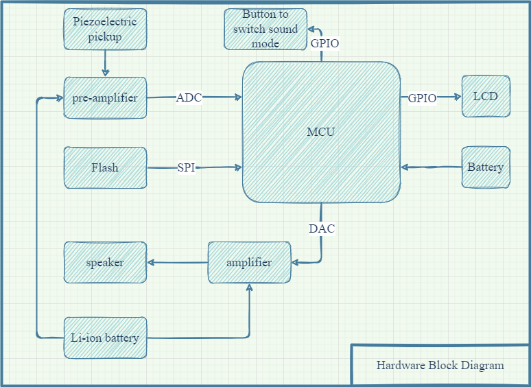
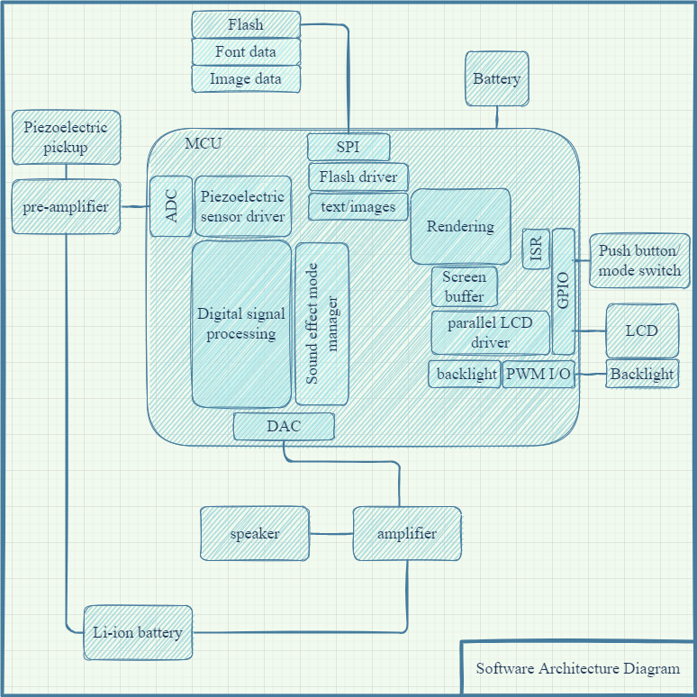
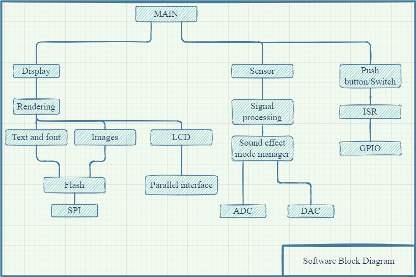
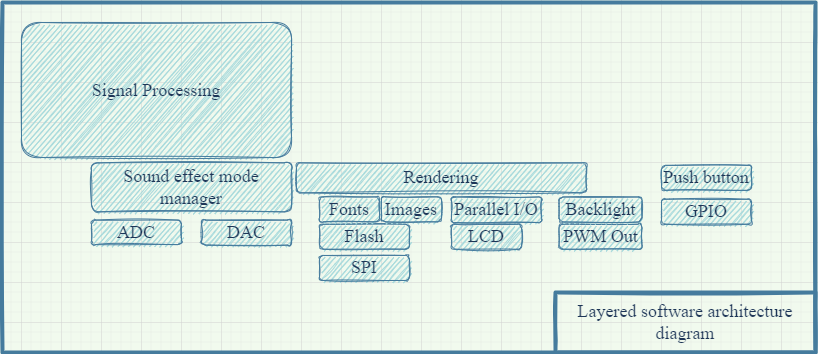

# Digital guitar effect
My project idea is to build a digital effect to enchance sound of my ukulele with piezoelectric pickup. I want to have a plug and play guitar effect which is small in size and can serve as a portable amplifier that can be connected to a speaker. There will be a possibility to choose modes: clean (no effect), distortion, delay, reverb or anything else that I will be able to create via digital signal processing techniques.  
## Hardware Block Diagram
.

## Software Architecture Block Diagram
.
## Hierarchy of Control Dagram

## Layered Software Architecture Diagram
