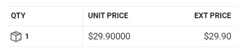

# Project boards
## STM32F429 Discovery board
### Hardware block diagram
  
### What kind of processor is it?
- **Processor name:** STM32F429ZIT6 with  Arm® Cortex®-M4 32-bit RISC  
- How much Flash and RAM does it have? Any other memory types?
  - Flash 2 Mbytes
  - RAM - 256 Kbytes
  - SDRAM 64-Mbit
- Does it have any special peripherals? (List 3-5 that you find interesting.)
  - 2.4" QVGA TFT LCD
  - MEMS motion sensor 3-axis digital output gyroscope
  - STlink
- If it has an ADC, what are the features?  
No ADC mentioned in evaluation board documentation, however for the microcontroller it is stated in -  https://www.st.com/en/microcontrollers-microprocessors/stm32f429zi.html#overview, that it has 3 ADCs and 2 DACs 
- How much does the board cost vs what the processor costs? Is the processor in stock
anywhere? (Try Digikey, Mouser, Octopart, Google, and so on.)
  - processor
   
  - board
   
## pyRuler
### Hardware block diagram
.

### What kind of processor is it?
- **Processor name:** ATSAMD21E18 32-bit Cortex M0+ 
- How much Flash and RAM does it have? Any other memory types?
  - Flash 256 Kbytes
  - RAM - 32 Kbytes
  - SDRAM 64-Mbit
- Does it have any special peripherals? (List 3-5 that you find interesting.)
  - Capacitive touch pins
  - AP102-2020 dotStar smd RGB LED
  - LEDs user and status
  - USB (Power, HID, serial console)
- If it has an ADC, what are the features? 
  - One 12-bit, 350ksps Analog-to-Digital Converter (ADC) with up to 20 channels 
    - Differential and single-ended input
    - 1/2x to 16x programmable gain stage
    - Automatic offset and gain error compensation
    - Oversampling and decimation in hardware to support 13-, 14-, 15- or 16-bit resolution
- How much does the board cost vs what the processor costs? Is the processor in stock
anywhere? (Try Digikey, Mouser, Octopart, Google, and so on.)
  - board (pyruler)
   
  - board (trinket m0 eval board)
   
  - processor (ATSAMD21E18)
   
      