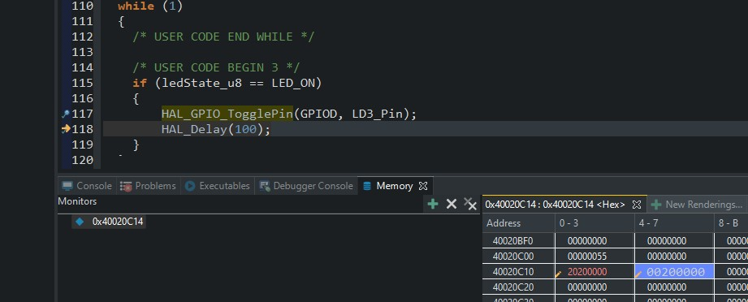

# Make Blinky !
The goal is to make a evaluation board blink its led.

## Board used
My board of choice is **_STM32F411E-DISCO_**

## Build and programming environment 
I used **_STM32CubeMxIDE_** to generate and write code. I took advantage of STM32F4xx_HAL_Driver to speed up coding process.

## Implementation
Implementation of blinky can be found [here](https://github.com/FoxCode-JF/making-embedded-systems-class/blob/7dc71bd7d169f4e0b30de5fee6f2f328039a9272/homework/Excercise3/blinky_project/Core/Src/main.c).  
### Description
In the main loop desired state of LED is checked. If the state is LED_ON the led on the board starts blinking.  
The desired state can be changed by a button interrupt. Normally the button pin is pulled down and its state is set to high when button is pressed. Button press causes an interrupt on the falling edge.  
If the LED is blinking and the button is pressed the LED stops blinking. If the LED is not blinking and the button is pressed it starts blinking.
To make the button more reliable software debouncing technique was used (based on Jack Ganssle's [article](http://www.ganssle.com/debouncing-pt2.htm)).

## Excercise questions
[Processor manual]().
- What are the hardware registers that cause the LED to turn on and off?  
    To set turn the led on or off we can use **_GPIOx_ODR_** or **_GPIOx_BSSR_**. First one is Output Data Register which can be used to read or write to GPIO PINS and second one is Bit Set/Reset Register which can be used to write to a register and address a specific pin. The latter performs bit set in atomic manner which means that setting or resetting bits can not be disturbed by other operations e.g. interrupts
 
- What are the registers that you read in order to find out the state of the button?  
    **_GPIOx_IDR_**, which allows to read data only. **_GPIOx_ODR_** which can be used to read or to write to a register
- Can you read the register directly and see the button change in a debugger or by
printing out the value of the memory at the register’s address?  
    Yes, by debugger see picture below :). For printing printf based on UART must be implemented.  
    .