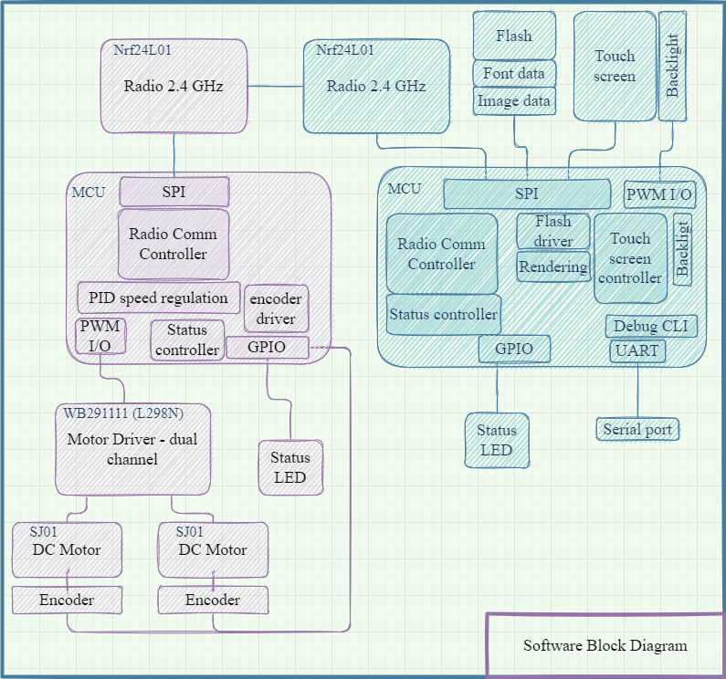

# **Touch screen controlled toy vehicle**
The written part of the assignment is an introduction to the system for another programmer.  
The write up should include:
## **Application description**
The system is a remote controlled mobile vehicle. It consists of two devices which communicate via radio:
- Remote controller.  
The brain of the controller is STM32F429ZIT6 (STM32F411-DISCO, ARM coretex). It controls touch tft display. Sliding across the display changes robot's speed and direction. 
- Mobile robot  
A vehicle with two wheels, each driven by DC motor with encoder (for speed feedback). The heart and the brain of vehicle is STM32F411VE (STM32F429-disc1, arm coretex).

## **Hardware description**
### **STM32F411-DISCO**
Evaluation board with __STM32F411VE__ MCU.
### **STM32F429-disc1**
Evaluation board with __STM32F429ZIT6__ MCU.
### **2.4" QVGA TFT LCD**
The display is a part of STM32F429-disc1 eval board 
### **Radio**
Both Mobile robot and remote controller are equipped with 2.4 GHz radios (__nRF24L01__).
### **Motors**
__SJ01__ DC motors with integrated gearbox and encoder (incremental quadrature encoder).  
### **Motor driver**
__WB291111__ dual channel motor driver with double H bridge (__L298N__)
### **LED**
On board leds are used to indicate state of the device.
### **FLASH**
On board flash included in __STM32F429ZIT6__
### **Hardware Block Diagram**

## **Software description**
The software consists of two separate software blocks:
- mobile robot software,
- remote controller sftware.
### **Describe the code in general**
### **Describe the parts you wrote in some** detail (maybe 3-5 sentences per module)
### Describe code you re-used from other sources, including the licenses for those
## **Diagram(s) of the architecture**
### **Software block diagram**

### **Layered block diagram**

### **Hierarchy of control**

## **Build instructions**
### **How to build the system (including the toolchain(s))**
#### **Hardware**
#### **Software**
### **How you debugged and tested the system**

### **How you powered it (and how you might in the future)**

## **Future**

### **What would be needed to get this project ready for production?**
- Redesigning mobile platform (mechanically).
- Make cases for controller and the vehicle
- Design custom chip instead of using eval boards that can reduce costs
- Encrypt the code so noone can copy it
- Write bootloader with possibility of firmware update
- Use BLE for communication between devices
### **How would you extend this project to do something more?** 
- Are there other features you’d like? How would you go about adding them?
Obstacle detection and emergency stop.
Robot control using IMU. Tilting the controller would make vehicle move.
## **Grading**
### **Self assessment of the project: for each criteria, choose a score (1, 2, 3) and explain your reason for the score in 1-2 sentences.**
### **Have you gone beyond the base requirements? How so?**